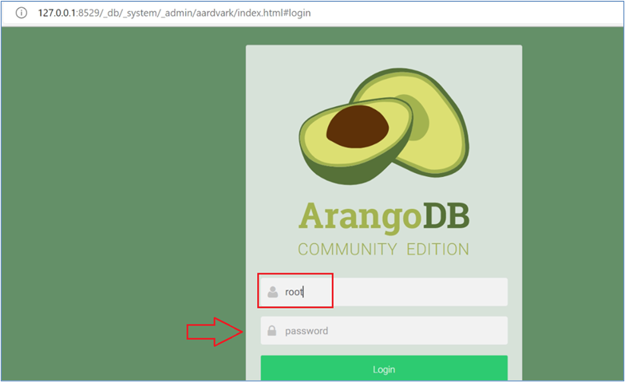
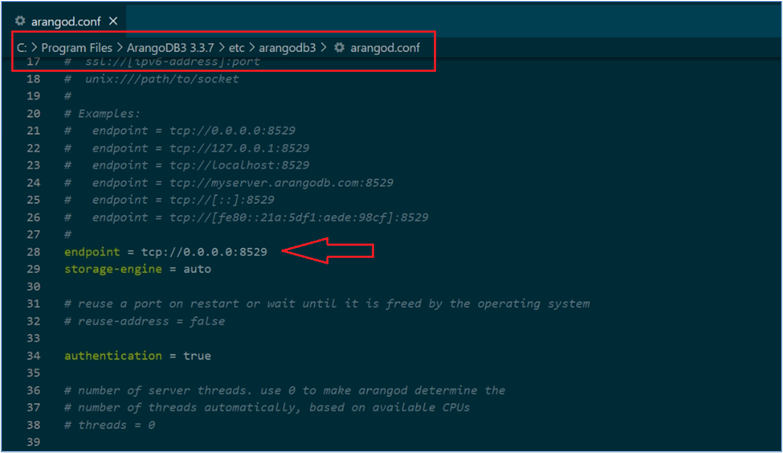
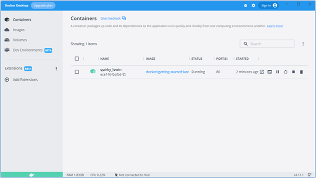
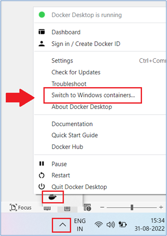

Setup
=====

Avatar server pack
------------------

* Clone the avatar-server-pack repo
.. image:: images/Picture1.png
    :width: 400
* Browse to avatars/prod/sample

* Check and edit a few params (LOCAL_IP) in the below files
    * **.env**
    .. image:: images/Picture2.png
        :width: 400
    * **d23-variables.env**
    .. image:: images/Picture3.png 
        :width: 400
    * Correct the ``d23.db`` data → delete records 2 to 4
    .. image:: images/Picture4.png
        :width: 400

ArangoDB
--------

* Install ``ArangoDB 3.3.7-1_win64.exe`` from https://download.arangodb.com/arangodb33/Windows7/x86_64/index.html

* Keep a blank password for now

* Launch ArangoDB
    * Username → **root**
    * Password → **blank**
    * Database → **_system**

.. image:: images/Picture6.png
    :width: 400

* Browse to the path ``C:/Program Files/arangoDB 3.3.7/etc/arangodb3``

* Update the endpoint in the ``arango.conf`` file to ``tcp://0.0.0.0:8529``

* Restart arangodb service

  * Press ``Windows Key + R``
  * Type ``services.msc``
  * Choose ``ArangoDB > (Re)start service`` 

Docker Desktop
--------------

* Ensure Docker Desktop is up and online, check WSL status, and take remediation steps if Docker does not work.

* Ensure to switch on virtualization at the BIOS level if needed.

* Ensure Docker is running under Linux containers.

* Open the ``variables.env`` file from ``\prod\sample`` and update the contents from the dowloadable `variables.env <https://github.com/erwintayag/avatar-server-docs-1/blob/main/docs/source/reference_files/variables.env>`_

* Start docker → ``docker-compose -f docker-compose.yml up``
